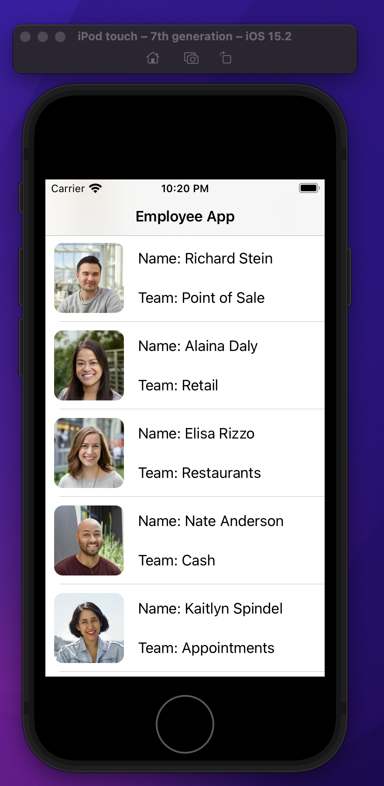
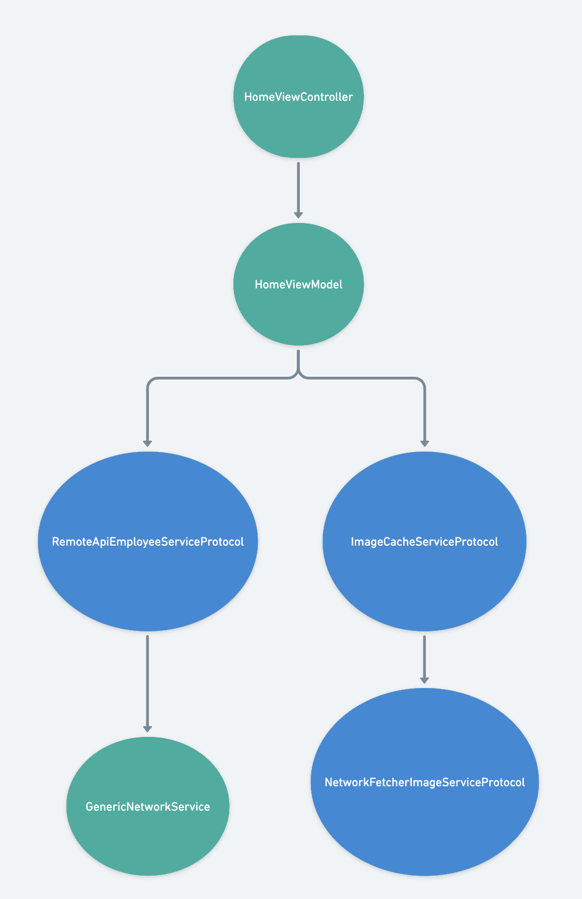

# EmployeesApp

# Scope
Employees App is a simple app that fetches a list of employees from a un-authorized 
endpoint and shows the results in a TableView. 

The scode was reduced to iPhones and the device orientation as Portrait

# UI
The UI was built programmatically with UIKit. 



# Architecture:
MVVM 


Important classes:
1. AppFactoryContainer
    It is the object factory of the app, it helps instanctiating
    ViewControllers, Services, etc. It also stores of global services or variables if they need to be persisted when the app
    is running. 

    One usage example is when presenting a new view controller, the 
    AppFactoryContainer can be called like the following:
    ```
        let newViewController = AppFactoryContainer.makeViewController()
        self.present(newViewController)
    ``` 
    So the `makeViewController` will create the the new View Controller while injecting all of its depedencies. 


1. HomeViewController 
    This is the main and only view controller of this app. 

    Important properties:
    * `mainView`: it is a view object that contains all the elements of the ui. 
    *  `viewModel`
    *  `model`: data of the tableView
    
2. HomeViewModel
    It consumes the corresponding newtorking services to fetch
    the data from servers whenever is required, plus it is binded
    to the UI to show the changes of data. 

3. RemoteAPIEmployeeService
    It is a service that uses the `GenericNetworkService` under the hood and it fetches the list of employee from the servers.
4. ImageCacheService: 
    It is a service that deals with the image caching.
4. RemoteImageFetcherService
    It is a service that helps downloading images. 
3. GenericNetworkService
    It is a static class that has some methods with generic parameters that it is being used to request data from servers. 


# Dependency graph:



Other relevant points:
## Steps to run the app:
It doesn't have any cocoa libraries so it is just download and play.

## What areas of the app did you focus on?
Architecture

## What was the reason for your focus? What problems were you trying to solve?
The idea was to create an app easy to maintain, testable, efficient.
I also considered SOLID principles. 

## How long did you spend on this project?
Around 6 hours

## Did you make any trade-offs for this project? What would you have done differently with more time?
I could implement something fancier for the indenpency injection, like having a dependency container, a resolver, service locator...

I could have refactored the TableViewCell, I didn't finish its MVVM implementation, it looks a little bit mixed up.


## What do you think is the weakest part of your project?
I wasn't sure if the project required the images to be stored in a persistant storage or simply in memory. In any case, I could implemented if it is required. 

Normally I use memory cache for simple projects but I can use coredata if is needed or I could use the [Kingfisher](https://github.com/onevcat/Kingfisher) library.

## Did you copy any code or dependencies? Please make sure to attribute them here!
I used an small helper class to implement reflection in swift for the some unit tests.

## Is there any other information you’d like us to know?
https://www.linkedin.com/in/hugoreyesamell/

